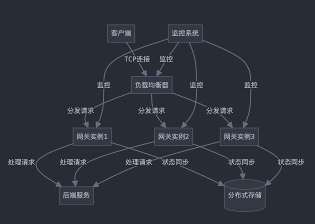

# go_shield
基于Golang实现的一个高可用、高并发的TCP网关服务。

## 系统架构图

基于这个架构图，我们可以看到，goshield 是一个基于Golang实现的TCP网关服务。它主要由以下几个部分组成：
- 负载均衡器： 负责请求的负载均衡，将请求分发到多个服务器。
    - 负载均衡算法： 负责请求的负载均衡，将请求分发到多个服务器。
    - 健康检查机制： 负责检查服务器的健康状态，如果服务器不健康，则将请求分发到其他的服务器。
- 网关实例： 负责处理请求，并将请求转发到对应的服务，需要实现的核心功能包括：
    - 流量控制：使用令牌桶算法，实现请求的限流。
    - 连接池管理：维护与后端服务的长链接池。
    - 协议转换：如果需要，在不同协议间进行转换。
    - 安全性：使用TLS加密，实现数据的安全传输。

- 分布式存储:

    - 使用Redis集群或etcd存储网关的配置信息和运行时状态。
    - 确保网关实例之间的状态一致性。

- 监控系统:
    - 使用Prometheus + Grafana监控整个系统的性能指标。
    - 设置告警阈值,及时发现并处理异常情况。

- 高可用性:
    - 使用Keepalived实现负载均衡器的故障转移。
    - 网关实例采用无状态设计,便于水平扩展。

- 高并发:
    - 利用异步I/O和事件驱动编程模型。
    - 使用连接池复用TCP连接。
    - 采用多线程处理,充分利用多核CPU资源。
